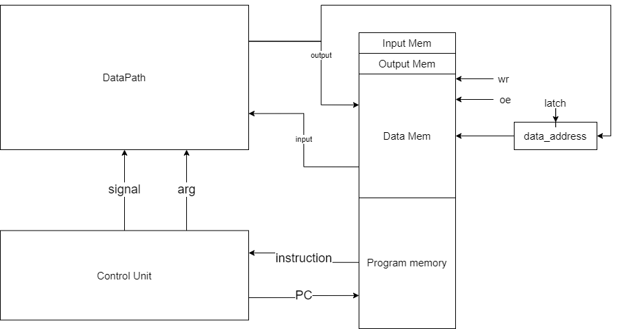
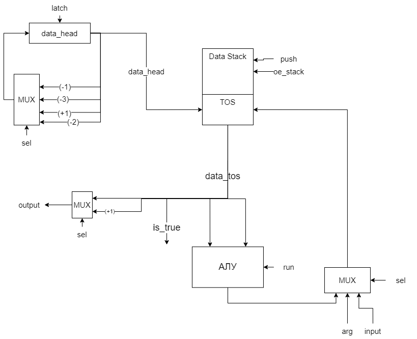

 # Forth. Транслятор и модель

- Иванов Алексей P33131.
- `forth | stack | neum | hw | tick | struct | stream | mem | prob5`

## Язык программирования

``` ebnf
program ::= term

term ::= command
        | var_init
        | string_init
        | push_symbol
        | term term

command ::= "NOP" | "MOD" | "+" | "<" | "NEGATE" | "INVERT" | "DUP" | "OVER" | "ROT" | "SWAP" | "DROP" 
            | "INTERRUPT" | "INTERRUPT_END" 
            | "IF" | "ELSE" | "ENDIF" 
            | "WHILE" | "BEGIN" | "REPEAT"
            | READ | READ# | WR | WR#

push_symbol = [-2^31; 2^31], ["a"; "z"]

string_init = (string_name): string_value

var_init ::= var_name: var_value 
                | &string_name

```

Код выполняется последовательно. Операции:

- `OVER` -- ... `a b` >> ... `a b a` 
- `DUP` -- ... `a` >> ... `a a`
- `<` -- ... `a b` >> ... `a<b`
- `MOD` -- ... `a b` >> ... `a%b`
- `NEGATE` -- ... `a` >> ... `-a`
- `INVERT` -- ... `0` >> ... `-1`
- `+` -- ... `a b` >> ... `a+b`
- `DROP` -- ... `a b` >> ... `a`
- `ROT` -- ... `a b c` >> ... `b c a`
- `SWAP` -- ... `a b` >> ... `b a`
- `{num}` -- ... `a b` >> ... `a b {num}`
- `{char}` -- ... `a b` >> ... `a b {char}`
- `IF` -- возьмёт со стека значение, и если оно True, то перейдёт далее. Если False, то прыгнет на ELSE
- `ELSE` -- сработает в случае, если при IF на стеке лежало False
- `ENDIF` -- закрывает блок кода, принадлежащий IF
- `BEGIN` -- является меткой, для возвращения назад, когда мы в цикле
- `WHILE` -- возьмёт со стека значение, и если оно True, то перейдёт далее. Если False, то прыгнет на команду, на +1 дальше, чем REPEAT
- `REPEAT` -- возвращает на BEGIN в случае если во время WHILE было True 
- `NOP` -- заглушка. не выполняет никаких операций
- `READ` (чтение с прямой адресацией)-- берёт со стека значение `x` и кладёт на стек значение memory[x]
- `READ#` (чтение с косвенной адресацией) -- берёт со стека значение `x`, кладёт на стек значение memory[memory[x]], и увеличивает значение memory[x] на +1
- `WR` (запись с прямой адресацией) -- берёт со стека значение `x`, и значение `y` и записывает в память memory[x] = y
- `WR#` (запись с косвенной адресацией) -- берёт со стека значение `x`, и значение `y` и записывает в память memory[memory[x]] = y, и увеличивает значение memory[x] на +1

## Организация памяти
Модель памяти процессора:

1. Память команд. Машинное слово -- не определено. Реализуется списком словарей, описывающих инструкции (одно слово -- одна ячейка).
2. Память данных. Машинное слово -- 32 бита, знаковое. Линейное адресное пространство. Реализуется списком чисел.
3. Стек. Заменяет регистры. Машинное слово -- 32 бита, знаковое. Линейное адресное пространство. Реализуется списком чисел.

Строки, объявленные пользователем распеделяются по памяти один символ на ячейку.

```text
     Instruction memory
+-----------------------------+
| 00  : jmp N                 |
| 01  : interrupt handler     |
|    ...                      | 
| n   : program start         |
|    ...                      |
+-----------------------------+

Data memory
+-----------------------------+
| 00  : input                 |
| 01  : output                |
| 03  : data                  |
|    ...                      |
| 127 : data                  |
| 127 : program               |
| 128 : program               |
|    ...                      |
+-----------------------------+
```

## Система команд

Особенности процессора:

- Машинное слово -- 32 бит, знаковое.
- `Память`:
    - адресуется через регистр `data_address`;
    - может быть записана:
        - с макушки стека;
        - с буффера ввода
    - может быть прочитана:
        - в буффер вывода;
- `Стек`:
    - адресуется через регистр `data_head`;
    - Верхушка стека (верхние 3 элемента):
        - может быть записана:
            - из буфера;
        - может быть прочитана:
            - на вход АЛУ
            - на вывод
        - используется как флаг `is_true` 1 - на верхушке `True`, иначе `False`
- Ввод-вывод -- stream.
- `program_counter` -- счётчик команд:
    - инкрементируется после каждой инструкции или перезаписывается инструкцией перехода.

### Набор инструкции

| Syntax         | Mnemonic        | Кол-во тактов | Comment                           |
|:---------------|:----------------|---------------|:----------------------------------|
| `OVER`         | OVER            | 1             | см. язык                          |
| `DUP`          | DUP             | 1             | см. язык                          |
| `<`            | LT              | 2             | см. язык                          |
| `MOD`          | MOD             | 2             | см. язык                          |
| `NEGATE`       | NEG             | 2             | см. язык                          |
| `INVERT`       | INV             | 2             | см. язык                          |
| `+`            | PLUS            | 2             | см. язык                          |
| `DROP`         | DROP            | 1             | см. язык                          |
| `ROT`          | ROT             | 1             | см. язык                          |
| `SWAP`         | SWAP            | 1             | см. язык                          |
| `{sym}`        | PUSH `{sym}`    | 1             | см. язык                          |
| `IF`           | JNT {ELSE + 1}  | 1             | см. язык                          |
| `ELSE`         | JMP {ENDIF}     | 1             | см. язык                          |
| `ENDIF`        | NOP             | 1             | см. язык                          |
| `BEGIN`        | BEGIN           | 1             | см. язык                          |
| `WHILE`        | JNT {REPEAT + 1}| 1             | см. язык                          |
| `REPEAT`       | JMP {BEGIN + 1} | 1             | см. язык                          |
| `NOP`          | NOP             | 1             | см. язык                          |
| `WR`           | WR_DIR          | 2             | см. язык                          |
| `WR#`          | WR_NDR          | 6             | см. язык                          |
| `READ`         | READ_DIR        | 2             | см. язык                          |
| `READ#`        | READ_NDR        | 7             | см. язык                          |


### Кодирование инструкций

- Машинный код сериализуется в список JSON.
- Один элемент списка, одна инструкция.
- Индекс списка -- адрес инструкции. Используется для команд перехода.

Пример:

```json
[
   {
        "opcode": "PUSH",
        "arg": "0",
        "term": [
            1,
            "PUSH",
            "0"
        ]
    }
]
```

где:

- `opcode` -- строка с кодом операции;
- `arg` -- аргумент (может отсутствовать);
- `term` -- информация о связанном месте в исходном коде (если есть).

Типы данные в модуле [isa](isa.py), где:

- `Opcode` -- перечисление кодов операций;
- `Term` -- структура для описания значимого фрагмента кода исходной программы.

## Транслятор

Интерфейс командной строки: `translator.py <input_file> <target_file> <data_section_file>"`

Реализовано в модуле: [translator](translator.py)

Этапы трансляции (функция `translate`):
1. Трансформирование текста в последовательность значимых термов.
    - Переменные:
        - Транслируются в соответствующие значения на этапе трансляции.
        - Задаётся либо числовым значением, либо указателем на начало строки (используя &string_name)
2. Проверка корректности программы (одинаковое количество IF, ELSE, ENDIF и BEGIN, WHILE, REPEAT).
3. Генерация машинного кода.

Правила генерации машинного кода:

- одно слово языка -- одна инструкция;
- для команд, однозначно соответствующих инструкциям -- прямое отображение;
- для циклов с соблюдением парности (многоточие -- произвольный код):

    | Номер команды/инструкции | Программа | Машинный код |
    |:-------------------------|:----------|:-------------|
    | n                        | `BEGIN`   | `BEGIN`      |
    | ...                      | ...       | ...          |
    | n+3                      | `WHILE`   | `JNT (k+1)`  |
    | ...                      | ...       | ...          |
    | k                        | `REPEAT`  |  `JMP (n+1)` |
    | k+1                      | ...       | ...          |
- для условных операторов (многоточие -- произвольный код):

    | Номер команды/инструкции | Программа | Машинный код |
    |:-------------------------|:----------|:-------------|
    | n                        | `IF`      | `JNT n+4`    |
    | ...                      | ...       | ...          |
    | n+3                      | `ELSE`    | `JMP (k+1)`  |
    | ...                      | ...       | ...          |
    | k                        | `ENDIF`   |  `NOP`       |
    | k+1                      | ...       | ...          |

## Модель процессора

Реализовано в модуле: [machine](machine.py).



Сигналы (обрабатываются за один такт, реализованы в виде методов класса Memory):

- `wr` -- записать в data memory
- `oe` -- прочитать из data memory 
- `latch_data_address` -- защёлкнуть значение в `data_address`

### DataPath



Сигналы (обрабатываются за один такт, реализованы в виде методов класса):

- `push` -- записать на макушку стека значение из АЛУ, input или argument
- `oe_stack` -- прочитать из макушки стека и отправить в output
- `latch_data_head` -- защёлкнуть значение в `data_head`

Флаги:

- `is_true` -- лежит ли на стеке true.

### АЛУ


Сигналы (обрабатываются за один такт, реализованы в виде методов класса):

- `operation_sel` -- произвести операцию

### ControlUnit


Реализован в классе `control_unit`.

- Hardwired (реализовано полностью на python).
- Моделирование на уровне тактов.
- Трансляция инструкции в последовательность (0-7 тактов) сигналов: `decode_and_execute`.

Сигнал:

- `latch_program_couter` -- сигнал для обновления счётчика команд в control_unit.

Особенности работы модели:

- Для журнала состояний процессора используется стандартный модуль logging.
- Количество инструкций для моделирования ограничено hardcoded константой.
- Остановка моделирования осуществляется при помощи исключений:
    - `StopIteration` -- если выполнена инструкция `halt`.
- Управление симуляцией реализовано в функции `simulate`.

## Апробация

В качестве тестов использовано 3 алгоритма:

1. [hello world](examples/hello_world_code).
2. [cat](examples/cat_code) -- программа `cat`, повторяем ввод на выводе.
3. [prob2](examples/prob5_code) -- программа, решающая 5 проблему Эйлера.

Голден-тесты: [golden](golden)


CI:

``` yaml
lab3-example:
  stage: test
  image:
    name: python-tools
    entrypoint: [""]
  script:
    - pip install pytest-golden
    - python3-coverage run -m pytest --verbose
    - find . -type f -name "*.py" | xargs -t python3-coverage report
    - find . -type f -name "*.py" | xargs -t pep8 --ignore=E501
    - find . -type f -name "*.py" | xargs -t pylint
```

где:

- `python3-coverage` -- формирование отчёта об уровне покрытия исходного кода.
- `pytest` -- утилита для запуска тестов.
- `pep8` -- утилита для проверки форматирования кода. `E501` (длина строк) отключено, но не следует этим злоупотреблять.
- `pylint` -- утилита для проверки качества кода. Некоторые правила отключены в отдельных модулях с целью упрощения кода.
- Docker image `python-tools` включает в себя все перечисленные утилиты. Его конфигурация: [Dockerfile](./Dockerfile).

Пример использования и журнал работы процессора на примере `cat`:

``` console
> cat examples/cat_code
BEGIN
    #in
    READ
    #out
    WR
    -1
    WHILE
REPEAT
> cat examples/input_hello
Alsiva
> ./translator.py examples/cat.code target.out examples/data_section
source LoC: 8 code instr: 9
> cat target.out 
[
    {
        "opcode": "PUSH",
        "arg": "0",
        "term": [
            1,
            "PUSH",
            "0"
        ]
    },
    {
        "opcode": "PUSH",
        "arg": "-1",
        "term": [
            2,
            "PUSH",
            "-1"
        ]
    },
    {
        "opcode": "PUSH",
        "arg": "-1",
        "term": [
            3,
            "PUSH",
            "-1"
        ]
    },
    {
        "opcode": "PUSH",
        "arg": "-1",
        "term": [
            4,
            "PUSH",
            "-1"
        ]
    },
    {
        "opcode": "PUSH",
        "arg": "-1",
        "term": [
            5,
            "PUSH",
            "-1"
        ]
    },
    {
        "opcode": "PUSH",
        "arg": "-1",
        "term": [
            6,
            "PUSH",
            "-1"
        ]
    },
    {
        "opcode": "BEGIN",
        "term": [
            7,
            "BEGIN",
            null
        ]
    },
    {
        "opcode": "JNT",
        "arg": 13,
        "term": [
            8,
            "WHILE",
            null
        ]
    },
    {
        "opcode": "PUSH",
        "arg": 0,
        "term": [
            9,
            "PUSH",
            0
        ]
    },
    {
        "opcode": "READ_DIR",
        "term": [
            10,
            "READ",
            null
        ]
    },
    {
        "opcode": "PUSH",
        "arg": 1,
        "term": [
            11,
            "PUSH",
            1
        ]
    },
    {
        "opcode": "WRITE_DIR",
        "term": [
            12,
            "WR",
            null
        ]
    },
    {
        "opcode": "JMP",
        "arg": 7,
        "term": [
            13,
            "REPEAT",
            null
        ]
    },
    {
        "opcode": "HALT",
        "term": [
            14,
            "HALT",
            null
        ]
    }
]
> ./machine.py machine_code.out examples/data_section examples/input_hello
DEBUG:root:{TICK: 1, PC: 1, HEAD: 0, TOS: 0, 0, 0}  PUSH 0 ('0' @ 2:PUSH)
DEBUG:root:{TICK: 2, PC: 2, HEAD: 1, TOS: 0, 0, 0}  READ_DIR  ('None' @ 3:READ)
DEBUG:root:{TICK: 3, PC: 2, HEAD: 0, TOS: 0, 0, 0}  READ_DIR  ('None' @ 3:READ)
INFO:root:input: l,s,i,v,a << A
DEBUG:root:{TICK: 4, PC: 3, HEAD: 1, TOS: 0, 0, 65}  PUSH 1 ('1' @ 4:PUSH)
DEBUG:root:{TICK: 5, PC: 4, HEAD: 2, TOS: 0, 65, 1}  WRITE_DIR  ('None' @ 5:WR)
DEBUG:root:{TICK: 6, PC: 4, HEAD: 2, TOS: 0, 65, 1}  WRITE_DIR  ('None' @ 5:WR)
DEBUG:root:output:  << A
DEBUG:root:{TICK: 7, PC: 5, HEAD: 0, TOS: 0, 0, 0}  PUSH -1 ('-1' @ 6:PUSH)
DEBUG:root:{TICK: 8, PC: 6, HEAD: 1, TOS: 0, 0, -1}  JNT 8 ('None' @ 7:WHILE)
DEBUG:root:{TICK: 9, PC: 7, HEAD: 0, TOS: 0, 0, 0}  JMP 1 ('None' @ 8:REPEAT)
DEBUG:root:{TICK: 10, PC: 1, HEAD: 0, TOS: 0, 0, 0}  PUSH 0 ('0' @ 2:PUSH)
DEBUG:root:{TICK: 11, PC: 2, HEAD: 1, TOS: 0, 0, 0}  READ_DIR  ('None' @ 3:READ)
DEBUG:root:{TICK: 12, PC: 2, HEAD: 0, TOS: 0, 0, 0}  READ_DIR  ('None' @ 3:READ)
INFO:root:input: s,i,v,a << l
DEBUG:root:{TICK: 13, PC: 3, HEAD: 1, TOS: 0, 0, 108}  PUSH 1 ('1' @ 4:PUSH)
DEBUG:root:{TICK: 14, PC: 4, HEAD: 2, TOS: 0, 108, 1}  WRITE_DIR  ('None' @ 5:WR)
DEBUG:root:{TICK: 15, PC: 4, HEAD: 2, TOS: 0, 108, 1}  WRITE_DIR  ('None' @ 5:WR)
DEBUG:root:output: A << l
DEBUG:root:{TICK: 16, PC: 5, HEAD: 0, TOS: 0, 0, 0}  PUSH -1 ('-1' @ 6:PUSH)
DEBUG:root:{TICK: 17, PC: 6, HEAD: 1, TOS: 0, 0, -1}  JNT 8 ('None' @ 7:WHILE)
DEBUG:root:{TICK: 18, PC: 7, HEAD: 0, TOS: 0, 0, 0}  JMP 1 ('None' @ 8:REPEAT)
DEBUG:root:{TICK: 19, PC: 1, HEAD: 0, TOS: 0, 0, 0}  PUSH 0 ('0' @ 2:PUSH)
DEBUG:root:{TICK: 20, PC: 2, HEAD: 1, TOS: 0, 0, 0}  READ_DIR  ('None' @ 3:READ)
DEBUG:root:{TICK: 21, PC: 2, HEAD: 0, TOS: 0, 0, 0}  READ_DIR  ('None' @ 3:READ)
INFO:root:input: i,v,a << s
DEBUG:root:{TICK: 22, PC: 3, HEAD: 1, TOS: 0, 0, 115}  PUSH 1 ('1' @ 4:PUSH)
DEBUG:root:{TICK: 23, PC: 4, HEAD: 2, TOS: 0, 115, 1}  WRITE_DIR  ('None' @ 5:WR)
DEBUG:root:{TICK: 24, PC: 4, HEAD: 2, TOS: 0, 115, 1}  WRITE_DIR  ('None' @ 5:WR)
DEBUG:root:output: A,l << s
DEBUG:root:{TICK: 25, PC: 5, HEAD: 0, TOS: 0, 0, 0}  PUSH -1 ('-1' @ 6:PUSH)
DEBUG:root:{TICK: 26, PC: 6, HEAD: 1, TOS: 0, 0, -1}  JNT 8 ('None' @ 7:WHILE)
DEBUG:root:{TICK: 27, PC: 7, HEAD: 0, TOS: 0, 0, 0}  JMP 1 ('None' @ 8:REPEAT)
DEBUG:root:{TICK: 28, PC: 1, HEAD: 0, TOS: 0, 0, 0}  PUSH 0 ('0' @ 2:PUSH)
DEBUG:root:{TICK: 29, PC: 2, HEAD: 1, TOS: 0, 0, 0}  READ_DIR  ('None' @ 3:READ)
DEBUG:root:{TICK: 30, PC: 2, HEAD: 0, TOS: 0, 0, 0}  READ_DIR  ('None' @ 3:READ)
INFO:root:input: v,a << i
DEBUG:root:{TICK: 31, PC: 3, HEAD: 1, TOS: 0, 0, 105}  PUSH 1 ('1' @ 4:PUSH)
DEBUG:root:{TICK: 32, PC: 4, HEAD: 2, TOS: 0, 105, 1}  WRITE_DIR  ('None' @ 5:WR)
DEBUG:root:{TICK: 33, PC: 4, HEAD: 2, TOS: 0, 105, 1}  WRITE_DIR  ('None' @ 5:WR)
DEBUG:root:output: A,l,s << i
DEBUG:root:{TICK: 34, PC: 5, HEAD: 0, TOS: 0, 0, 0}  PUSH -1 ('-1' @ 6:PUSH)
DEBUG:root:{TICK: 35, PC: 6, HEAD: 1, TOS: 0, 0, -1}  JNT 8 ('None' @ 7:WHILE)
DEBUG:root:{TICK: 36, PC: 7, HEAD: 0, TOS: 0, 0, 0}  JMP 1 ('None' @ 8:REPEAT)
DEBUG:root:{TICK: 37, PC: 1, HEAD: 0, TOS: 0, 0, 0}  PUSH 0 ('0' @ 2:PUSH)
DEBUG:root:{TICK: 38, PC: 2, HEAD: 1, TOS: 0, 0, 0}  READ_DIR  ('None' @ 3:READ)
DEBUG:root:{TICK: 39, PC: 2, HEAD: 0, TOS: 0, 0, 0}  READ_DIR  ('None' @ 3:READ)
INFO:root:input: a << v
DEBUG:root:{TICK: 40, PC: 3, HEAD: 1, TOS: 0, 0, 118}  PUSH 1 ('1' @ 4:PUSH)
DEBUG:root:{TICK: 41, PC: 4, HEAD: 2, TOS: 0, 118, 1}  WRITE_DIR  ('None' @ 5:WR)
DEBUG:root:{TICK: 42, PC: 4, HEAD: 2, TOS: 0, 118, 1}  WRITE_DIR  ('None' @ 5:WR)
DEBUG:root:output: A,l,s,i << v
DEBUG:root:{TICK: 43, PC: 5, HEAD: 0, TOS: 0, 0, 0}  PUSH -1 ('-1' @ 6:PUSH)
DEBUG:root:{TICK: 44, PC: 6, HEAD: 1, TOS: 0, 0, -1}  JNT 8 ('None' @ 7:WHILE)
DEBUG:root:{TICK: 45, PC: 7, HEAD: 0, TOS: 0, 0, 0}  JMP 1 ('None' @ 8:REPEAT)
DEBUG:root:{TICK: 46, PC: 1, HEAD: 0, TOS: 0, 0, 0}  PUSH 0 ('0' @ 2:PUSH)
DEBUG:root:{TICK: 47, PC: 2, HEAD: 1, TOS: 0, 0, 0}  READ_DIR  ('None' @ 3:READ)
DEBUG:root:{TICK: 48, PC: 2, HEAD: 0, TOS: 0, 0, 0}  READ_DIR  ('None' @ 3:READ)
INFO:root:input:  << a
DEBUG:root:{TICK: 49, PC: 3, HEAD: 1, TOS: 0, 0, 97}  PUSH 1 ('1' @ 4:PUSH)
DEBUG:root:{TICK: 50, PC: 4, HEAD: 2, TOS: 0, 97, 1}  WRITE_DIR  ('None' @ 5:WR)
DEBUG:root:{TICK: 51, PC: 4, HEAD: 2, TOS: 0, 97, 1}  WRITE_DIR  ('None' @ 5:WR)
DEBUG:root:output: A,l,s,i,v << a
DEBUG:root:{TICK: 52, PC: 5, HEAD: 0, TOS: 0, 0, 0}  PUSH -1 ('-1' @ 6:PUSH)
DEBUG:root:{TICK: 53, PC: 6, HEAD: 1, TOS: 0, 0, -1}  JNT 8 ('None' @ 7:WHILE)
DEBUG:root:{TICK: 54, PC: 7, HEAD: 0, TOS: 0, 0, 0}  JMP 1 ('None' @ 8:REPEAT)
DEBUG:root:{TICK: 55, PC: 1, HEAD: 0, TOS: 0, 0, 0}  PUSH 0 ('0' @ 2:PUSH)
DEBUG:root:{TICK: 56, PC: 2, HEAD: 1, TOS: 0, 0, 0}  READ_DIR  ('None' @ 3:READ)
DEBUG:root:{TICK: 57, PC: 2, HEAD: 0, TOS: 0, 0, 0}  READ_DIR  ('None' @ 3:READ)
DEBUG:root:Input buffer is Empty
output: Alsiva
instr_counter:  44 ticks: 57
```

| ФИО         | алг.  | code инстр. | инстр. | такт. | вариант                                                  |
|-------------|-------|-------------|--------|-------|----------------------------------------------------------|
| Иванов А.А. | hello | 16          | 118    | 222   | forth, stack, neum, hw, tick, struct, stream, mem, prob5 |
| Иванов А.А. | cat   | 8           | limit  | 57    | forth, stack, neum, hw, tick, struct, stream, mem, prob5 |
| Иванов А.А. | prob5 | 132         | 654    | 2239  | forth, stack, neum, hw, tick, struct, stream, mem, prob5 |
